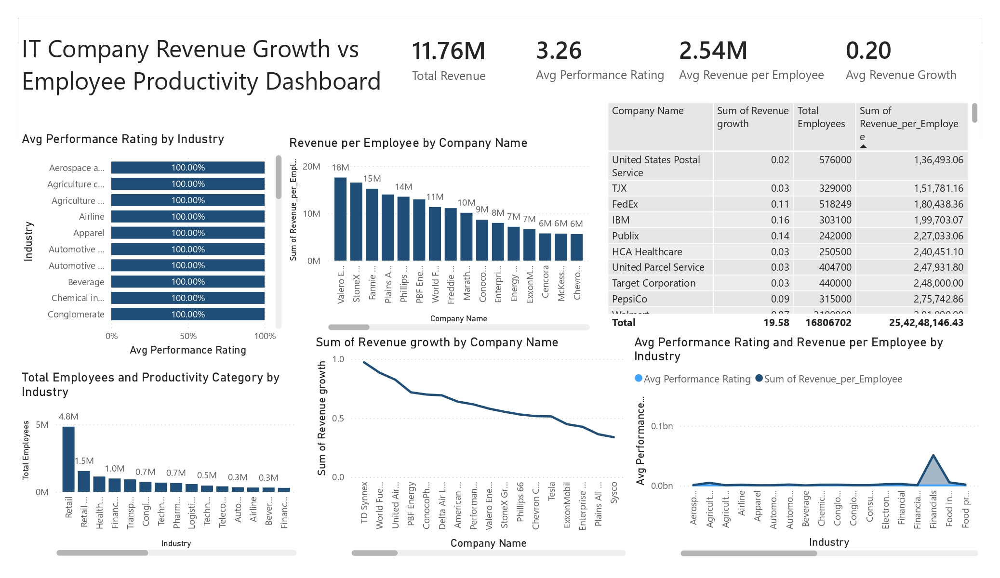

# 📊 IT Company Revenue Growth vs Employee Productivity Dashboard

## 📌 Project Overview

The **IT Company Revenue Growth vs Employee Productivity Dashboard** is an interactive Power BI project designed to analyze how employee productivity influences revenue generation and business growth across different industries and companies.

This dashboard provides a comprehensive view of key performance indicators (KPIs), employee efficiency metrics, revenue growth trends, and industry-level comparisons to help organizations make data-driven decisions.

---

## 🖥️ Dashboard Preview

---

## 🎯 Objectives

- Analyze the relationship between employee productivity and company revenue.
- Compare performance ratings across industries.
- Identify companies with the highest revenue per employee.
- Evaluate workforce distribution by industry.
- Monitor revenue growth trends across organizations.
- Support strategic business planning and resource allocation.

---

## 📈 Key Performance Indicators (KPIs)

| Metric | Value |
|----------|----------|
| Total Revenue | 11.76M |
| Average Performance Rating | 3.26 |
| Average Revenue per Employee | 2.54M |
| Average Revenue Growth | 0.20 |

---

## 📊 Dashboard Components

### 1. KPI Cards
Provides a quick overview of:
- Total Revenue
- Average Performance Rating
- Average Revenue per Employee
- Average Revenue Growth

### 2. Average Performance Rating by Industry
- Compares employee performance ratings across industries.
- Helps identify industries with high-performing workforces.

### 3. Revenue per Employee by Company
- Displays revenue generated per employee.
- Highlights organizations with efficient workforce utilization.

### 4. Company Revenue Growth Analysis
- Tracks revenue growth trends for individual companies.
- Identifies top-performing organizations.

### 5. Employee Distribution by Industry
- Shows total employee count across industries.
- Helps understand workforce concentration.

### 6. Industry Productivity Analysis
- Compares average performance ratings with revenue generated per employee.
- Reveals industries that maximize employee productivity.

### 7. Company Performance Table
Includes:
- Company Name
- Revenue Growth
- Total Employees
- Revenue per Employee

---

## 🔍 Business Insights

### Key Findings

- Retail and logistics industries employ the largest workforce.
- Certain companies generate significantly higher revenue per employee, indicating strong operational efficiency.
- Industries with higher employee performance ratings generally demonstrate better revenue outcomes.
- Revenue growth varies considerably among companies, suggesting differences in business strategies and productivity management.

---

## 🛠️ Tools & Technologies Used

- **Power BI Desktop**
- **Power Query**
- **DAX (Data Analysis Expressions)**
- **Data Modeling**
- **Business Intelligence & Analytics**

---

## 📂 Dataset Information

The dataset contains information related to:

- Company Names
- Industry Categories
- Revenue
- Revenue Growth
- Employee Count
- Performance Ratings
- Revenue per Employee
